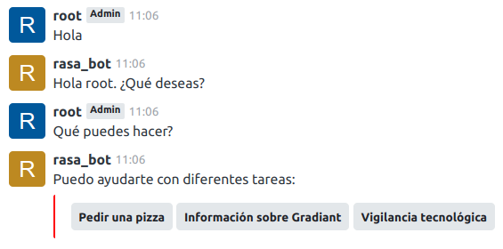
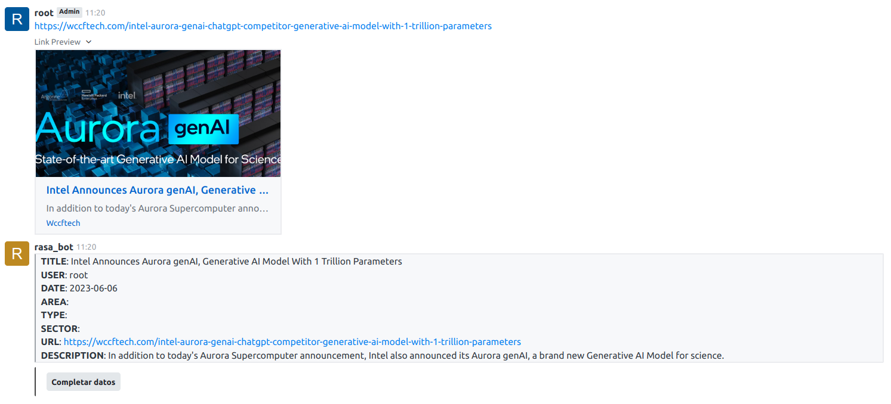
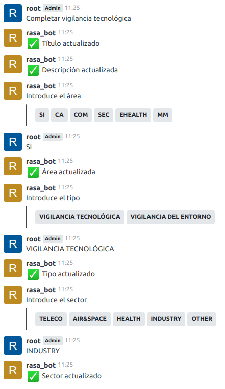
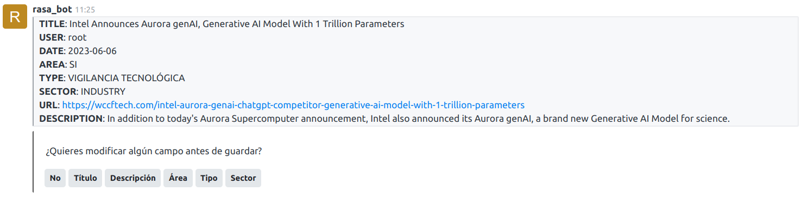
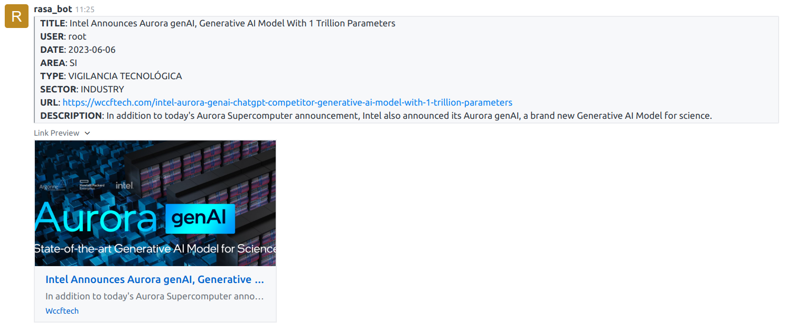

# RASA BOT - PUBLIC PROOF OF CONCEPT

## Overview
Public proof of concept of a bot to perform technological surveillance and automation tasks.

## Requirements
- Requires docker version >= 24.0.2
- Requires docker-compose version >= 2.18.1
- Requires GNU Make version >= 4.2.1

**Note.** It may work on minor versions of some product, but correct operation is not guaranteed.

## Installation

```
git clone https://github.com/srgottfried/TFC.git
```

## Getting Started

1. Deploy the application by running:
    ```
    make deploy
    ```

2. If it is the **first time** you are deploying the application on your machine, restore the internal configurations by running:
    ```
    make init
    ```
    If you have already deployed the application before and have a `data/db` directory, you can skip this step.

3. Access RocketChat through the URL:
    ```
    http://localhost:3000/
    ```

    You can access the service with the following roles:
    
    |rol|username|password|
    |--|--|--|
    |admin|root|root|
    |user|manuellandin|manuel|
    |bot|rasa_bot|rasabot|

    **Note.** The **rasa_bot** is simply a standard user with the "bot" role assigned.

4. Start a conversation through the **general** chat or by speaking directly with **rasa_bot**. You can start an interaction by saying "Hola" or simply asking "¿qué puedes hacer?"

    

## Technological Surveillance
A primitive form of technological surveillance has been implemented.
To initiate the surveillance, it is sufficient to send the URL that is intended to be registered:



To continue:

1. Complete the surveillance data through a form:

    

2. Perform data modification actions:

    

3. Process the recorded information:

    

In addition, you can check the information sent to an api-fake in:
```
http://localhost:8000/
```

## Ending Up

Shut down the application and clean up deploy resources:
```
make down
```
